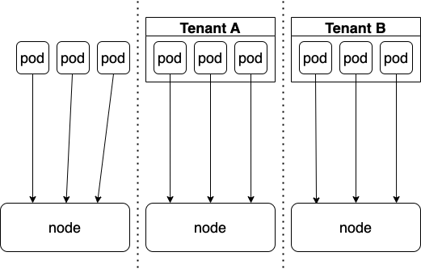

# Обзор способов организации мультитенантности в кластерах Kubernetes

В компаниях, использующих Kubernetes, где идет одновременная разработка нескольких продуктов и, соответственно, есть несколько команд, появляется необходимость организации доступа к кластерам. Причем команды во время использования кластеров не должны мешать друг другу и, в идеале, не иметь возможности это сделать.

Меня зовут Михаил Сидоров, я разработчик в команде R&D облачной платформе Platform V. Мы делаем решение для создания multi-tenant кластеров и изучили, какими способами такие кластера готовят. В этой статье мы поговорим о некоторых способах организации мультитенатности (multi-tenancy) в кубернетес кластерах, рассмотрим их плюсы и минусы

### Что такое Multi-tenancy 
Сначала определим что же такое мультитенантность (multi-tenancy).

В общем случае мультитенантность - это предоставление изолированного доступа для арендаторов (tenant) к каким-то общим ресурсам
В нашем случае тенант - это команда, отдeльный разработчик или какой-то внешний клиент, а общий ресурс - кластер кубера

Существует два вида мультитенантности:

- Soft multi-tenancy - основная задача состоит в предотвращении случайного доступа к ресурсам другого тенанта, однако полной изоляции нет. Этот вариант хорошо подходит для случаев, когда мы доверяем командам
- Hard multi-tenancy - полная изоляция тенантов друг от друга, используется когда мы хотим полностью исключить воздействие одного тенанта на другого, даже преднамеренное

Для организации мультитенантности в случае кубернетес кластеров нужно организовать изоляцию на трех уровнях:

- Изоляция на уровне API  - каждый тенант должен иметь доступ только к своим ресурсам
- Сетевая изоляция - приложения одного тенанта не должны иметь сетевой доступ к приложениям другого
- Изоляция на уровне воркеров - работа приложений одних тенантов, не должна сказываться на работе других

Самым простым способом организовать изоляцию для команд будет создание отдельных кластеров. Здесь важно отметить, что в рамках этой статьи мы не будем рассматривать необходимость создания отдельных кластеров в целом. Про то, когда стоит или не стоит создавать отдельные кластера можно почитать например в [этой](https://habr.com/ru/company/flant/blog/498100/) статье. Здесь мы коснемся только вопросов целесообразности создания кластеров для изоляции сред для команд.

## Отдельные кластеры: подойдут ли для изоляции?


Суть подхода очень проста - для каждой команды создается отдельный кластер. 

Строго говоря, под наше определение мультитенантности кубернетеса такой подход не попадает, поскольку между тенантами разделяется не сам kubernetes, а низлежащая облачная инфраструктура. Однако SIG-Multitenancy все же [считают](https://kubernetes.io/blog/2021/04/15/three-tenancy-models-for-kubernetes/) это моделью организации мультитенантности (Cluster-as-a-Service).

С одной стороны, это действительно позволяет обеспечить полную изоляцию и независимость сред: сразу “из коробки” получаем hard multi-tenancy. С другой, если команд много, есть риск столкнуться с разрастанием числа кластеров ([cluster sprawl](https://d2iq.com/blog/the-cause-and-effect-of-cluster-sprawl)): количество проблем и их сложность будет стремительно возрастать.

Какие минусы есть у этого подхода:

- Для каждой новой команды придется создавать отдельный кластер. При этом в каждый из кластеров придется ставить и конфигурировать инфраструктурные компоненты, такие как ingress, cert-manager, мониторинг, логгирование, автоскейлинг и так далее.
- Плохая утилизация ресурсов. Для каждого кластера будет нужен свой контролплейн, и возможности переиспользовать инфраструктурные компоненты тоже не будет. Помимо этого утилизация воркеров тоже будет ниже, чем если бы мы запускали все приложения в одном кластере
- Сложность администрирования. Каждый кластер нужно будет по отдельности поддерживать, обновлять, мониторить и логгировать. Когда кластеров сотни это становится очень сложной задачей
- Консистентность ресурсов. Когда кластеров много, становится сложно поддерживать консистентность политик, секретов, инфраструктурных компонентов и ресурсов между этими кластерами.

Несмотря на все это, сейчас появляется все больше инструментов для упрощения работы с большим количеством кластеров. Для развертывания и операций с кластерами можно использовать managed решения (EKS, GKE), [cluster-api](https://cluster-api.sigs.k8s.io/), и такие проекты как [Gardener](https://github.com/gardener/gardener) в связке с Terraform. Его же можно использовать и для установки инфраструктурных компонентов и поддержания их консистентности. 

Одним словом, здесь нет конструктивных сложностей и доработок, только проблемы с администрированием, которые, тем не менее, можно решить. Однако оверхед по ресурсам может быть очень существенным, особенно если команде нужно запустить всего парочку микросервисов. Поэтому для решения проблемы изоляции команд такой подход может быть крайне неэффективным.

## Мультитенантный кластер


В таком варианте мы разделяем один кластер между несколькими командами.

В отличие от подхода с выделением отдельных кластеров, вариантов организации мультитенантности в кластерах существует множество. Мы рассмотрим несколько вариантов и начнем с самого простого, который использует уже встроенные в кубернетес объекты

### Нативная мультитенантность

Итак, для начала рассмотрим самый базовый способ сделать кубернетес мультитенатным, без каких-либо дополнительных расширений — организуем изоляцию через неймспейсы. 

Выделим три роли - администратор кластера, администратор неймспейса (команды) и пользователь (член команды).
Администратор кластера, имеющий полные права в кластере, задает права на создание объектов через Role либо ClusterRole и привязывает их внутри определенного неймспейса администратору команды через RoleBinding, а тот, в свою очередь, дает необходимые права на взаимодействия с объектами членам своей команды (для этого необходимо дать права на создание RoleBinding). Например это можно сделать с помощью дефолтной роли admin:

> Allows admin access, intended to be granted within a namespace using a **RoleBinding**.If used in a **RoleBinding**, allows read/write access to most resources in a namespace, including the ability to create roles and role bindings within the namespace. 

``` sh
$ kubectl create rolebinding bob-admin-binding --clusterrole=admin --user=bob --namespace=tenant-alpha
```

В целом этого уже почти достаточно для Soft multi-tenancy: администратор команды сможет давать права на управление объектами только внутри своего неймспейса, при этом создать другой неймспейс он не сможет.
Для обеспечения сетевой изоляции можно ограничить взаимодействие между неймспейсами через [NetworkPolicies](https://kubernetes.io/docs/concepts/services-networking/network-policies/), дав, например, доступ только к общим инфраструктурным сервисам, Например так:

```yaml
---
apiVersion: networking.k8s.io/v1
kind: NetworkPolicy
metadata:
  name: default-deny-all
  namespace: tenant-alpha
spec:
  podSelector: {}
  policyTypes:
  - Ingress
  - Egress
---
apiVersion: networking.k8s.io/v1
kind: NetworkPolicy
metadata:
  name: allow-internet
  namespace: tenant-alpha
spec:
  egress:
  - to:
    - ipBlock:
        cidr: 0.0.0.0/0
        except:
        - 10.0.0.0/8
  podSelector: {}
  policyTypes:
  - Egress
```

Осталось позаботиться о том, чтобы ворклоады пользователей не мешали друг другу на нодах. Для этого во-первых нужно чтобы они не могли забрать себе слишком много ресурсов кластера в целом - решается через [ResourceQuotas](https://kubernetes.io/docs/concepts/policy/resource-quotas/). С помощью объекта ResourceQuota можно задать лимиты по определенным ресурсам внутри неймспейса: например задать суммарное потребление CPU, RAM или максимальное число подов:

``` yaml
apiVersion: v1
kind: ResourceQuota
metadata:
  name: pods
spec:
  hard:
    cpu: "100"
    memory: 20Gi
    pods: "100"
```


Помимо этого есть еще один инструмент, весьма полезный при организации мультитенантности - это PriorityClasses. Он позволяет задавать приоритет подам. Например у тенанта есть какой-то не очень важный ворклоад, тогда можно задать ему PriorityClass с низким приоритетом и, если на ноде закончатся ресурсы и туда зашедулятся поды с более высоким приоритетом - наш под будет evicted и отправится ждать своей очереди на шедулинг. Но зачем кому-то пользоваться более низким приоритетом, если может произойти эвикшен? Все очень просто: на разные приоритеты можно задать разные квоты ресурсов! 

Вот так выглядит объект ResourceQuota с использованием PriorityClass:

``` yaml
apiVersion: v1
kind: ResourceQuota
metadata:
  name: pods-high
spec:
  hard:
    cpu: "4"
    memory: 8Gi
    pods: "10"
  scopeSelector:
    matchExpressions:
    - operator : In
      scopeName: PriorityClass
      values: ["high"]
```


Если тенант не задаст реквесты/лимиты к своим подам и на ноду зашудлятся поды других тенантов, может, например, случиться OOMKill (Out-Of-Memory Kill). Для того, чтобы исключить такие ситуации можно создать [LimitRange](https://kubernetes.io/docs/tasks/administer-cluster/manage-resources/memory-default-namespace/), тогда на все поды, для которых лимиты не были указаны, будут указываться те, что указаны в LimitRange. 
Если мы сначала создадим такой LimitRange:

``` yaml
apiVersion: v1
kind: LimitRange
metadata:
  name: mem-limit-range
spec:
  limits:
  - default:
      memory: 512Mi
    defaultRequest:
      memory: 256Mi
    type: Container
```
А затем создадим под:
``` yaml
apiVersion: v1
kind: Pod
metadata:
  name: default-mem-demo
spec:
  containers:
  - name: default-mem-demo-ctr
    image: nginx
```
То спека созданного пода будет выглядеть следующим образом:
``` yaml
containers:
- image: nginx
  imagePullPolicy: Always
  name: default-mem-demo-ctr
  resources:
    limits:
      memory: 512Mi
    requests:
      memory: 256Mi
```
Помимо этого с помощью LimitRange можно задавать минимальные и максимальные допустимые значения для ресурсов:

``` yaml
apiVersion: v1
kind: LimitRange
metadata:
  name: cpu-min-max-demo-lr
spec:
  limits:
  - max:
      cpu: "800m"
    min:
      cpu: "200m"
    type: Container
```


Для того, чтобы получить hard multi-tenancy остается предотвратить возможность эскалации привилегий. Для этого можно использовать sandbox container-а или системы микровиртуализации (например [gVisor](https://github.com/google/gvisor) или [Firecracker](https://github.com/firecracker-microvm/firecracker)) или выделенные ноды для тенантов.
Чтобы организовать выделенные ноды, нам нужно гарантировать что на определенные ноды будут шедулиться поды определенного тенанта и только они. Это можно сделать используя [Taints/Tolerations](https://kubernetes.io/docs/concepts/scheduling-eviction/taint-and-toleration/) + [Node Affinity](https://kubernetes.io/docs/concepts/scheduling-eviction/assign-pod-node/) (в нашем случае хватит вместо полноценного NodeAffinity хватит nodeSelector-а).
Рассмотрим на примере:
Пусть у нас есть тенант A и нода node-a
Тогда чтобы нода стала выделенной для тенанта достаточно повесить на нее taint:

``` sh
kubectl taint nodes node-a tenant=A:NoExecute
```
И лейбл:
```
kubectl label nodes node-a tenant=A
```
А на все поды тенанта вешать toleration и nodeSelector:
``` yaml
apiVersion: v1
kind: Pod
metadata:
  name: ...
spec:
  containers:
	...
  tolerations:
  - key: "tenant"
    operator: "Equal"
    value: "alpha"
    effect: "NoExecute"

  nodeSelector:
    tenant: alpha
```
Таким образом, благодаря nodeSelector все поды данного тенанта будут шедулиться только на ноды с соответствующим лейблом. А taint будет гарантировать, что никакие другие поды, кроме подов тенанта, которые имеют соответсвующий toleration, зашедулиться на них не смогут. Taint-ы особенно полезны для гарантий того, что инфраструктурные компоненты, живущие вне рамок какого-то определенного тенанта, не смогут оказаться на одной ноде с ворклоадом тенанта (если на них явно не указан соответствующий toleration)

Условно, вот как шедулинг будет выглядеть если не использовать ничего:

Если использовать только nodeSelector:

Этого уже может быть достаточно, поскольку поды, не относящиеся к тенантам, вероятно относятся к инфраструктуре и мы их контролируем, однако можно избежать мисконфигураций добавив toleration:


При этом нод селектор и толерейшен должен оказаться на КАЖДОМ поде тенанта КАЖДОГО тенанта. Если тенант сможет создать под  с каким-то своим нод селектором, то, подделав и толерейшен, он сможет оказаться на “чужой” ноде. 
 На помощь приходят mutating webhooks. Достаточно менять спеку пода при каждом реквесте на создание, добавляя туда необходимый селектор. В частности можно использовать уже готовый [PodNodeSelector](https://kubernetes.io/docs/reference/access-authn-authz/admission-controllers/#podnodeselector).

Тут важно отметить еще один момент. Предположим мы считаем, что нам достаточно иметь soft multi-tenancy, поскольку считаем, что намерения нашего тенанта чисты, и никакого вреда другим тенантам он намеренно наносить не собирается. Без дополнительных ограничений это все равно может случиться. 

Рассмотрим такой пример: 

Пусть у нас есть два тенанта, A и B. Тенант A хочет запустить какую-то требовательную к IOPS базу данных, при этом у нас есть всего один медленный StorageClass, а на воркерах у нас при этом быстрые NVME диски. Тенант вполне разумно решил замаунтить в под hostPath (то бишь какую-то папку на воркере) по какому-то пути, скажем /data. Ровно то же самое решил сделать и тенант B. Мы никак это действие не запрещали и желание это вполне разумно, однако весьма вероятно данные будут перезаписаны и испорчены. Поэтому, помимо всего прочего, даже в случае soft multi-tenancy стоит использовать [PodSecurityPolicy](https://kubernetes.io/docs/concepts/security/pod-security-policy/) (deprecated) или [PodSecurityStandart](https://kubernetes.io/docs/concepts/security/pod-security-standards/), ограничивающие параметры запуска контейнеров, связанные с безопасностью.
Так, например, чтобы запретить использование hostPath, при создании неймспейса можно добавить к нему следующие лейблы, которые приведут к применению в неймспейсе PodSecurityStandart baseline (хороший вариант для soft мультитенантности):

``` yaml
apiVersion: v1
kind: Namespace
metadata:
  name: my-baseline-namespace
  labels:
   pod-security.kubernetes.io/enforce: baseline
    pod-security.kubernetes.io/enforce-version: latest
    pod-security.kubernetes.io/warn: baseline
    pod-security.kubernetes.io/warn-version: latest
```
И после всего этого, базовая мультитенантность готова :)

Выглядит гораздо сложнее, чем просто нарезка отдельного кластера…
Но это только начало!

### Hierarchical Namespaces

А что если команде понадобится не один неймспейс, а сразу несколько? А что если команда сама хочет уметь создавать неймспейсы для своих нужд? 
Эту проблема решается по-разному. Например, можно использовать [Hierarchical Namespace Controller](https://github.com/kubernetes-sigs/hierarchical-namespaces) (далее HNC). Между прочим проект создан SIG-Multitenancy, а значит должен подходить для реализации мультитенантности. По крайней мере в теории…
Разберемся же, что мы имеем на практике.
HNC добавляет возможность создавать иерархию неймспейсов: у неймспейса могут быть свои дочерние неймспейсы и при этом весь RBAC (по-дефолту) и любые другие объекты (можно настроить) будут наследоваться из родительского. А проблема создания неймспейсов тенантами решается введением нового объекта - Subnamespace. Тенанты могут создавать их, а контроллер уже нарежет реальные неймспейсы. При этом неймспейсы будут иметь древовидную структуру.


Так, в ns-1 и ns-2 будет скопирован весь RBAC из ns-root, а в ns-3 из ns-root и ns-1. 

Посмотрим совсем простой пример использования:
Создаем какой-то неймспейс (parent), далее создаем роль, разрешающую создание любых необходимых объектов и subnamespaceanchor.hnc.x-k8s.io в данном неймспейсе, привязываем роль к админу команды. Теперь, несмотря на то, что прав на создание неймспейсов у него по прежнему нет, он может создать вложенный неймспейс следующим образом:

``` sh
kubectl hns create child -n parent (используем плагин HNC для kubectl)
```

Контроллер создаст новый неймспейс child и скопирует в него весь RBAC из родительского неймспейс:

``` sh
$ kubectl hns tree parent
# Output:
parent
└── child
```

При этом под капотом, плагин просто создаст следующий объект:
``` yaml
apiVersion: hnc.x-k8s.io/v1alpha2
kind: SubnamespaceAnchor
metadata:
  namespace: parent
  name: child
```
То бишь как раз создаст объект из группы subnamespaceanchor.hnc.x-k8s.io, права на создание которого мы заранее выдали пользователю. Он в свою очередь уже будет подхвачен контроллером HNC, который уже создаст полноценный неймспейс и сделает его дочерним, после чего будет копировать туда все настроенные объекты. 

По дефолту он копирует только RBAC, но так же можно настроить, например, копирование LimitRanges:

``` sh
kubectl hns config set-resource limitranges --mode Propagate
```
Теперь все LimitRanges созданные в родительском кластере будут копироваться в дочерние, то есть мы гарантируем что в каждом кластере будет нужный нам LimitRanges, причем, поскольку роль так же копируется и доступа к LimitRanges админу команды мы не давали, никак изменить это поведение он не сможет.
С NetworkPolicies в целом похожая логика, только теперь нужно будет добавить лейбл селектор для неймспейсов, который будет наследоваться от корневого неймспейса

А вот с ResourceQuota нас ждет провал: поскольку объект просто копируется в свеже созданный неймспейс, для каждого дочернего неймспейса будет создаваться новая квота. Это создаст очень простую уязвимость: закончились ресурсы - просто создай еще один дочерний неймспейс, в котором будет свежая квота и используй ее дальше.

То есть построить hard multi-tenancy используя только HNC без дополнительных admission controller-ов нельзя :)

### Capsule
Это наверное наиболее продвинутый проект для реализации подхода Namespace-as-a-Service. В отличие от HNC, здесь появляется CRD **Tenant** - агрегирующий несколько неймспейсов. 


Хорошее демо Capsule можно посмотреть здесь:
<oembed>https://www.youtube.com/watch?v=H8bzEJN7fj8</oembed>

Мы же сфокусируемся на том, какую изоляцию можно получить, используя Capsule
Для этого рассмотрим спеку [Tenant](https://capsule.clastix.io/docs/general/references/#custom-resource-definition):

Самое главное - указание админов тенанта (можем задать сразу несколько):
``` yaml
owners:
- kind: User
    name: bob
- ...
```
Можем задавать дополнительную метадату, которая будет добавляться к созданным тенантом неймспейсам и максимальное количество неймспейсов которые он может создать:
``` yaml
namespaceOptions:
  quota: 3
  additionalMetadata:
    labels:
      capsule.clastix.io/tenant: gas
      pod-security.kubernetes.io/enforce: baseline
      pod-security.kubernetes.io/enforce-version: latest
      pod-security.kubernetes.io/warn: baseline
      pod-security.kubernetes.io/warn-version: latest
```
То есть проблема с необходимостью создания нескольких неймспейсов для тенанта решается. В созданных неймспейсах админ тенанта может создать RoleBinding для членов своей команды, при этом сохраняется автономия: админ кластера для этого действия не нужен. А дополнительная метадата может быть использована для во-первых использована для PodSecurityStandart (о котором писал выше),а во-вторых для NetworkPolicies:
``` yaml
networkPolicies:
  items:
  - egress:
    - to:
      - ipBlock:
          cidr: 0.0.0.0/0
        except:
        - 192.168.0.0/12
    ingress:
    - from:
      - namespaceSelector:
          matchLabels:
          capsule.clastix.io/tenant: gas
      - podSelector: {}
      - ipBlock:
          cidr: 192.168.0.0/12
    podSelector: {}
    policyTypes:
      - Ingress
      - Egress
```
Так же как и в HNC, networkPolicies будут копироваться в каждый созданный тенантом неймспейс и благодаря лейблу, который мы указали при создании, можем сделать связность между неймспейсами.

Окей, то есть с сетевой изоляцией тоже все впорядке. C 

LimitRanges:
``` yaml 
limitRanges:
  items:
  - limits:
    - max:
        cpu: "1"
        memory: 1Gi
      min:
        cpu: 50m
        memory: 5Mi
      default:
        cpu: 200m
        memory: 100Mi
      type: Pod
```
Так же копируется в каждый неймспейс созданный тенантом, тоже галочка

Что же с ResourceQuota? Тоже все впорядке:
``` yaml
  resourceQuotas:
    items:
      - hard:
          limits.cpu: "8"
          limits.memory: 16Gi
          requests.cpu: "8"
          requests.memory: 16Gi
        scopes:
        - NotTerminating
      - hard:
          pods: "10"
      - hard:
          requests.storage: 100Gi
```
Причем, в отличие от HNC, проблемы с "тупым копированием" нет. Цитата из спецификации CRD:
``` 
   resourceQuotas       <Object>
     Specifies a list of ResourceQuota resources assigned to the Tenant. The
     assigned values are inherited by any namespace created in the Tenant. The
     Capsule operator aggregates ResourceQuota at Tenant level, so that the hard
     quota is never crossed for the given Tenant. This permits the Tenant owner
     to consume resources in the Tenant regardless of the namespace. Optional.
```
Круто!
И даже есть добавлялка нод селекторов для изолированных нод!
Вот ее описание:
``` yaml
   nodeSelector <map[string]string>
     Specifies the label to control the placement of pods on a given pool of
     worker nodes. All namesapces created within the Tenant will have the node
     selector annotation. This annotation tells the Kubernetes scheduler to
     place pods on the nodes having the selector label. Optional.
```
И вот так ее можно применить:
``` yaml
  nodeSelector:
    tenant: alpha
```
Не хватает разве что toleration-ов.

Зато помимо этого можно задавать: регулярки для хостнеймов ингрессов, разрешенные сторедж классы и ингресс классы (можно тоже регулярками), разрешенные реджистри и т.д.

Однако все же остаются некоторые не закрытые проблемы: 

Нет доступа к cluster-scoped ресурсам. Допустим мы хотим посмотреть список наших неймспейсов, созданных через Capsule:
```
$ kubectl get namespaces
Error from server (Forbidden): namespaces is forbidden:
User "alice" cannot list resource "namespaces" in API group "" at the cluster scope
```
Неймспейсы создать можем, а посмотреть что создали - нет... Или все-таки можем?

Оказывается, что для Capsule есть proxy-сервер, который можно поставить перед kube-api и отправлять запросы на него, а он в свою очередь уже вернет список cluster-scoped ресурсов, к которым у тенанта есть доступ. Выглядит это так (картинка из документации):
```
                +-----------+          +-----------+         +-----------+
 kubectl ------>|:443       |--------->|:9001      |-------->|:6443      |
                +-----------+          +-----------+         +-----------+
                ingress-controller     capsule-proxy         kube-apiserver
```
На данном этапе поддерживаются:
* Неймспейсы
* Ноды (если мы указали node-selector)
* Сторедж классы
* Ингресс классы
* Приорити классы

## Honorable mentions: Rancher
Самый юзер-френдли проект из списка, тоже позволяющий организовать soft-multitenancy. [Rancher](https://github.com/rancher/rancher) скорее является полноценной экосистемой для менеджмента кубернетеса, с возможностью управления сразу большим количеством кластеров, поэтому не будем сильно вдаваться в подробности его реализации, однако примечательно, что в нем присутствует CRD [**Project**](https://rancher.com/docs/rancher/v2.5/en/cluster-admin/projects-and-namespaces/) по факту являющийся аналогом Tenant в Capsule (объединением множества неймспейсов):

Админ проекта так же может распоряжаться правами пользователей: 

Можно осуществлять сетевую изоляцию между, энфорсить PodSecurityPolicies на уровне проекта, задавать LimitRanges: 

Можно задать ResourceQuotas так же для всего проекта, а не для отдельных неймспейсов:

 Примечательно так же то, что здесь присутствует часть "фишек" из HNC, которых нет в Capsule: например возможность делать project-scoped секреты (секрет копируется во все неймспейсы проекта). Ну и свой аналог proxy-сервера тоже есть. А еще ранчер сделал свои Projects задолго до появления Capsule :)

 Тем не менее, Capsule гораздо более гибкий и позволяет максимально близко приблизиться к полной изоляции, не требуя при этом больших усилий.

## Заключение

Сегодня организация Namespace-as-a-Service стала гораздо проще, чем это было пару лет назад, когда приходилось бы создавать свой тулинг для применения всей этой массы политик. Однако, на мой взгляд, не смотря на то, что такие проекты как Capsule или Rancher позволяют очень легко организовать soft-multitenancy в кластерах, они по-прежнему слабо подходят для кейсов, когда нужна именно hard-multitenancy. 

И вот почему: 
* Ошибки в конфигурации. Вся изоляция так или иначе идет на уровне admission контроллеров, network policies, RBAC и т.д. Какие-то моменты могут быть пропущены, что приведет к потенциальным уязвимостям. Компрометация одного неймспейса приведет к компрометации всего кластера
* Урезанные права. С другой стороны, поскольку права на кластер урезаны, не все действия будут доступны. Так или иначе будут возникать ограничения при использовании cluster-scoped ресурсов (хотя бОльшая часть юзкейсов уже покрывается Capsule), невозможно использовать какие-то свои CRD, контроллеров и операторов, поскольку это может зааффектить других пользователей (а ведь с ростом популярности cloud-native приложений, с этими ограничениями придется сталкиваться все чаще) 
* Контролплейн централизован. Поскольку все среды находятся в одном кластере, нагрузка на контролплейн и общие контроллеры повышается и активное использование оных одной командой, может затронуть работоспособность соседней, что неминуемо ведет к необходимости введения различных квот и лимитов, требующих в свою очередь внедрения дополнительных admission controller-ов.

Так неужели нет какого-то решения, которое подошло бы для hard-multitenancy лучше? 

На самом деле есть и это виртуальные кластера или, в терминологии авторов HNC, Control-planes-as-a-Service. Собственно их мы и используем в нашем проекте и в скором времени поделимся нашим опытом